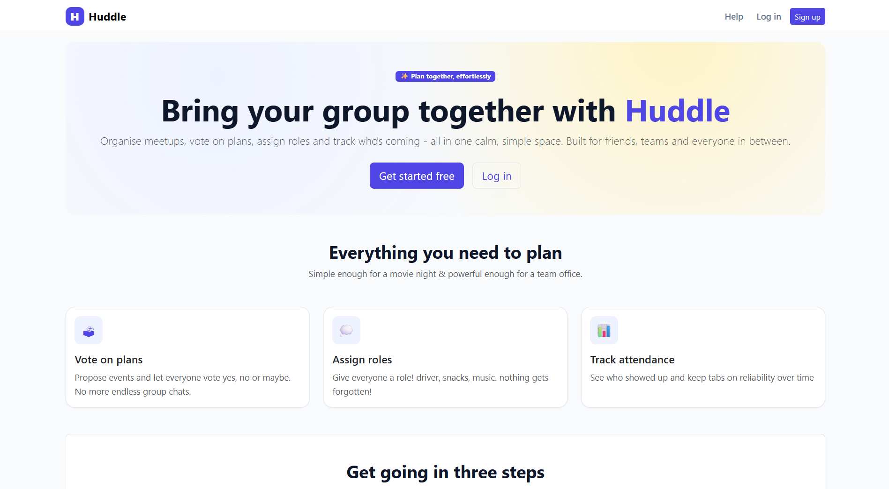
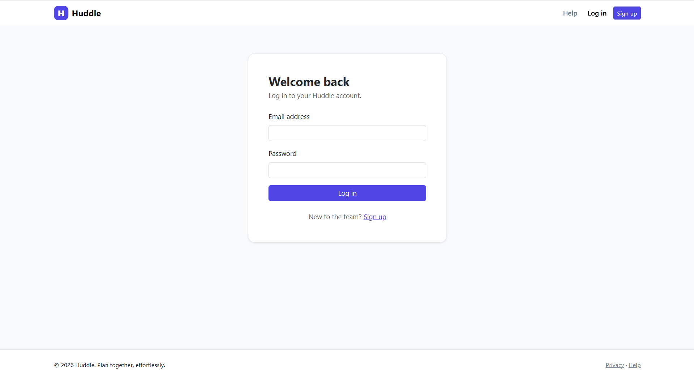
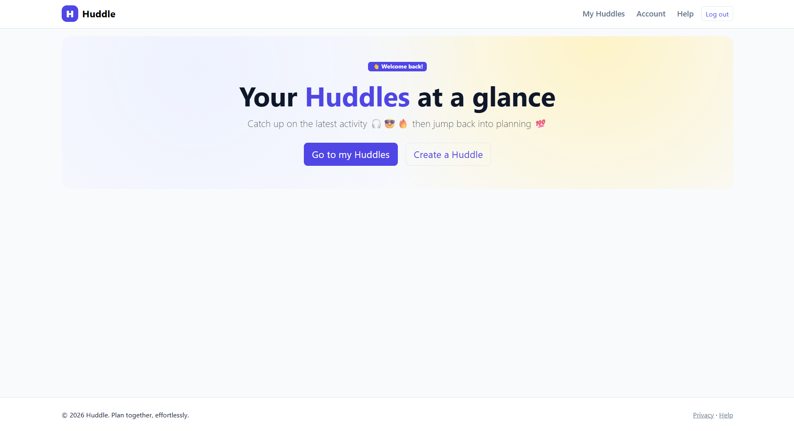
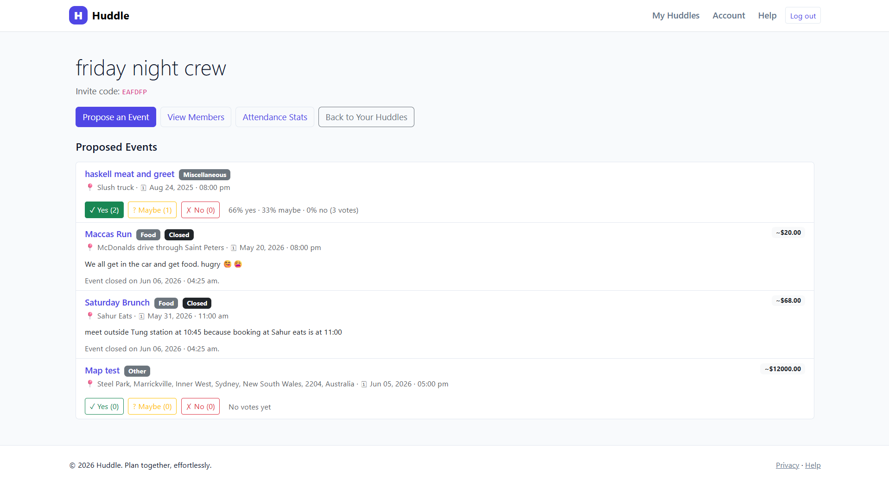
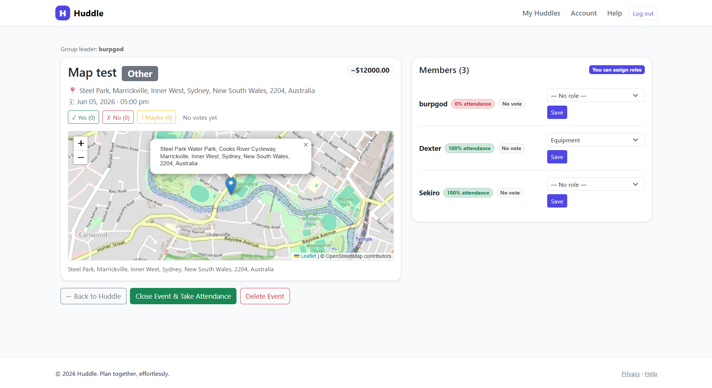
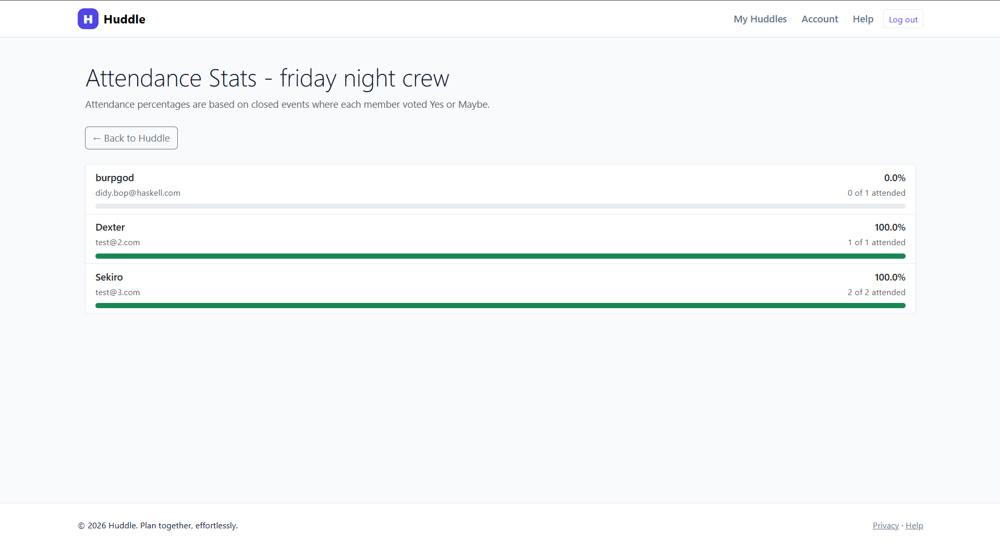

# Huddle

**Huddle** is a Progressive Web App (PWA) designed to help friend groups organise social events and improve commitment to plans. Instead of relying on busy group chats, users can create groups, propose activities, vote on events, assign roles, and track attendance in a single platform.

**Target Users:** Friend groups, clubs, sporting teams, and social communities who regularly organise events together.

---

## Project Status

**Current Sprint:** Sprint 3 – PWA Responsiveness & UI/UX Design ✅ Complete

**Last Increment:**
- Fully responsive interface (320px–2560px)
- Unified frontend theme across all pages
- Cross-platform breakpoint testing completed (PB-009)

**Next Planned Increment:**
- Sprint 4 – Documentation
- Systems Report completion
- Client Log finalisation
- Developer Diary completion

---

## Technologies Used

### Frontend
- HTML5
- CSS3
- JavaScript
- Bootstrap

### Backend
- Python
- Flask

### Database
- SQLite

### APIs & Libraries
- Leaflet.js
- OpenStreetMap
- PyOTP (Google Authenticator 2FA)

### Development Tools
- Git
- GitHub

---

## Features

### User Management
- Secure user registration and login
- Google Authenticator Two-Factor Authentication (2FA)

### Group Management
- Create groups
- Join groups using unique 6-character invite codes
- Assign custom member roles

### Event Planning
- Create event proposals
- Date and time scheduling
- Location selection with address autofill
- Interactive event map integration

### Voting System
- Yes / No / Maybe voting
- Live vote tally updates
- Percentage breakdown of responses

### Attendance Tracking
- Record attendance for completed events
- View individual attendance percentages
- Monitor participation across the group

### Responsive Design
- Mobile-first design
- Supports screen sizes from 320px to 2560px
- Progressive Web App functionality

---

## Installation

### Prerequisites
- Python 3.11+
- Git

### Setup

1. Clone the repository:

```bash
git clone
```

2. Navigate to the project directory
   

4. Install dependencies:

```bash
pip install -r requirements.txt
```

4. Configure environment variables:

```bash
cp .env.example .env
```

Add your:
- Secret key
- Database configuration
- Authentication settings

5. Run the application:

```bash
python main.py
```

6. Open your browser and navigate to:

```text
http://localhost:5000
```

---

## Usage

### Creating a Group

1. Register an account.
2. Set up Google Authenticator using the generated QR code.
3. Create a new group.
4. Share the generated invite code with friends.

### Creating an Event

1. Open your group dashboard.
2. Select **Create Event**.
3. Enter event details.
4. Choose a date, time, and location.
5. Submit the proposal.

### Voting on an Event

1. Open an event.
2. Select **Yes**, **No**, or **Maybe**.
3. View live voting statistics and attendance predictions.

### Tracking Attendance

1. Mark attendance after an event.
2. View attendance percentages in the group dashboard.

### Screenshots

#### Home page



#### Login Page



#### Dashboard



#### Event Voting



#### Event Voting



#### Attendance Tracking



---

## Project Structure

```text
Huddle/
│
├── .devcontainer/
├── .vscode/
├── data/
├── dist/
├── static/
├── templates/
│
├── .env
├── .gitattributes
├── .gitignore
├── LICENSE
├── main.py
├── PRODUCTBACKLOG.md
├── README.md
├── requirements.txt
├── security_log.log
└── SPRINTBACKLOG.md
```


## Backlog Documentation

- **PRODUCTBACKLOG.md** – User stories, priorities, acceptance criteria, and feature roadmap.
- **SPRINTBACKLOG.md** – Sprint goals, task allocation, testing results, reviews, and retrospectives.

---

## Licence

This project was developed for educational purposes as part of the HSC Software Engineering course.

Copyright © 2026

All Rights Reserved.

---

## Acknowledgements

- Project Clients: My Friends
- Mr Jones
- OpenStreetMap
- Leaflet.js
- Flask Community
- GitHub
- Bootstrap Development Team
